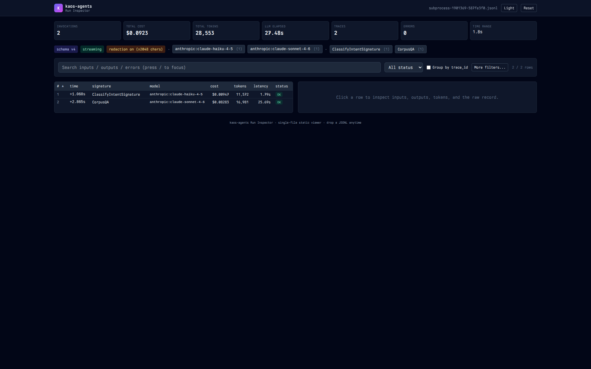
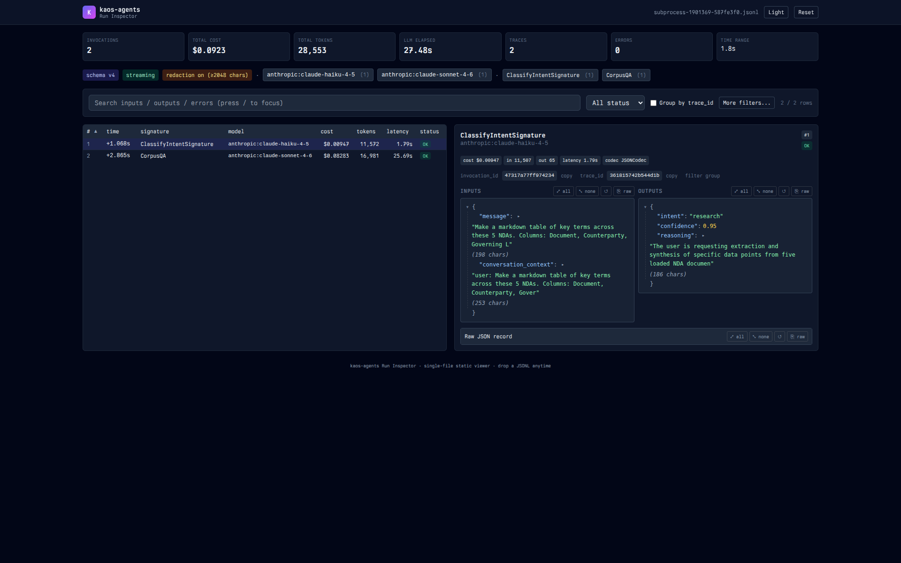

# kaos-agents

> **Part of [Kelvin Agentic OS](https://kelvin.legal) (KAOS)** — open agentic
> infrastructure for legal work, built by
> [273 Ventures](https://273ventures.com).
> See the [full KAOS package map](https://github.com/273v) for the rest of the stack.

[](https://pypi.org/project/kaos-agents/)
[](https://pypi.org/project/kaos-agents/)
[](https://github.com/273v/kaos-agents/blob/main/LICENSE)
[](https://github.com/273v/kaos-agents/actions/workflows/ci.yml)

`kaos-agents` is the agentic runtime for KAOS — Runner, SessionMemory, 6
patterns, 14 MCP tools, live audit trail. It sits above `kaos-llm-core`
(LLM programming primitives) and below applications. The agent is
stateless; all persistent state lives in `SessionMemory`, which hydrates
from the KAOS VFS at the start of every call and persists at the end.
This fits the MCP stateless-request model and keeps multi-turn behaviour
auditable.

The base install is small (`kaos-core`, `kaos-content`, `kaos-graph`,
`kaos-nlp-core`, `pydantic`). LLM transport is gated behind the
`[llm]` extra so applications that compose agents from outside a model
(memory-only tools, plan validation, audit replay) do not pull the
provider SDKs. MCP server, FastAPI surface, OpenTelemetry, rerank, and
each tool-bearing sibling module live behind their own extras.

## Install

```bash
uv add kaos-agents
# or
pip install kaos-agents
```

`kaos-agents` requires Python **3.13** or newer. Pure Python; no native
build. Common extras:

```bash
uv add 'kaos-agents[llm,office]'                # quickstart: LLM transport + DOCX parser
uv add 'kaos-agents[llm]'                       # just .turn() against in-memory text
uv add 'kaos-agents[llm,mcp]'                   # +MCP server bridge for kaos-agents-serve
uv add 'kaos-agents[llm,mcp,api]'               # +FastAPI HTTP surface
uv add 'kaos-agents[llm,pdf,office,source,web]' # +all tool-bearing siblings auto-registered
```

The Hello-World / NDA-batch quickstarts below load DOCX files via
`kaos-office`, so use the first form. Other extras for one-off uses:
`[citations]`, `[rerank]`, `[otel]`, `[source]`.

## Hello world (30 seconds)

The package ships 5 real mutual NDAs as package data. The Hello-World
demo loads all 5 and asks a default `ResearchAgent` (Anthropic Haiku
4.5) for a markdown summary table — defaults only. Requires
`ANTHROPIC_API_KEY` and `pip install 'kaos-agents[llm,office]'`.

```bash
python -m kaos_agents.examples.nda_review.hello
```

The runnable source at `kaos_agents/examples/nda_review/hello.py` fits
on one screen:

```python
import asyncio
from importlib.resources import files as _resource_files

from kaos_core.registry.container import KaosRuntime

from kaos_agents import ResearchAgent, SessionMemory, SessionStore

NDAS_DIR = _resource_files("kaos_agents.examples.nda_review").joinpath("ndas")


async def main():
    from kaos_content.serializers.markdown import serialize_markdown
    from kaos_office import parse_docx

    runtime = KaosRuntime.test_mode()                # in-memory VFS
    memory = SessionMemory("nda-hello")
    agent = ResearchAgent(runtime.vfs)               # default: claude-haiku-4-5
    for path in sorted(p for p in NDAS_DIR.iterdir() if p.name.endswith(".docx")):
        uri = path.name.replace(" ", "_")            # IRI-safe
        agent.load_document(memory, uri, serialize_markdown(parse_docx(str(path))))
    await SessionStore(runtime.vfs).save(memory)

    response = await agent.turn(
        "Make a markdown table of key terms across these 5 NDAs. Columns: "
        "Document, Counterparty, Governing Law, Term Length, Confidentiality "
        "Period, Mutual?, Non-Solicit?. One row per NDA. Keep cells short.",
        session_id="nda-hello",
    )
    print(response.text)
    print(f"\ncost_usd=${response.cost_usd:.4f}  total_tokens={response.total_tokens}")


asyncio.run(main())
```

**Expected output** (one live run, ~40 seconds wall-clock, ~$0.09
total across the 5 NDAs):

```
| Document | Counterparty | Governing Law | Term Length | Confidentiality Period | Mutual? | Non-Solicit? |
|---|---|---|---|---|---|---|
| EMNA_Mutual_NDA | ExMachi Bank N.A. | Delaware | 2 years | Until info no longer confidential or 1 yr from first disclosure | Yes | Yes (6 mo post-term) |
| MNDA_-_Acme | Acme Co. (Nevada) | Michigan | Indefinite (until released) | Survives termination unless released in writing | Yes | No |
| MNDA_-_BI | Beta Inc. (Delaware) | Michigan | 3 years | Survives termination unless released in writing | Yes | No |
| MNDA_-_CC_Final_2 | CyberCorp Co. (California) | Michigan | 5 years | Until info no longer confidential or 1 yr from first disclosure | Yes | Yes (1 yr post-term) |
| MNDA_-_DynaMo | DynaMo GmbH (Germany) | Delaware | 2 years | Until info no longer confidential or 1 yr from first disclosure | Yes | Yes (6 mo post-term) |

[Verified: 11 claim(s), 24 citation(s)]

cost_usd=$0.0903  total_tokens=17478
```

`ResearchAgent` runs RAG over the 5 docs in memory, verifies the answer
against retrieved spans, and surfaces the citation count at the bottom.
No cost cap — production users should set `max_cost_usd` or use
`quickstart.py` (below) for a strict per-doc cap and refusal contract.

## Production review (60 seconds)

The **production** version at `kaos_agents/examples/nda_review/quickstart.py`
is what a partner would sign off on: recall-first per-sentence
enumeration, typed findings with `block_ref` provenance, strict per-doc
cost cap, refusal contract, and an audit trail of every LLM call. Same
5 NDAs, Haiku 4.5 filter + Sonnet 4.6 synthesis:

```bash
python -m kaos_agents.examples.nda_review.quickstart
```

The pattern (abridged — see the file for the full version):

```python
from kaos_agents.patterns.findings import FindingsAgent, every_sentence_selector


async def review_one(docx_path):
    view = DocumentView(parse_docx(docx_path), sentence_segmenter=get_default_punkt_tokenizer())
    agent = FindingsAgent(
        selector=every_sentence_selector,              # Phase 1: enumerate EVERY sentence
        filter_model="anthropic:claude-haiku-4-5",     # Phase 2: cheap filter
        synthesis_model="anthropic:claude-sonnet-4-6", # Phase 3: synthesis with cites
        relevance_threshold=0.4,
        max_cost_usd=0.50,                             # strict per-doc cap
    )
    return await agent.run(
        "Review this NDA for deviations: governing law, term length, "
        "confidentiality survival, non-solicit clauses, signature anomalies.",
        view,
    )
```

Each NDA's review surfaces governing-law deviations, term-length
variance, confidentiality-period drift, and template artifacts (EMNA's
signature block reads "DynaMo" even though the parties are 273 Ventures
+ ExMachi Bank N.A.). Cites are encoded as `[finding_id]` references
back to AST blocks. Total spend lands near $0.18 across the 5 NDAs.

What the production version demonstrates that the Hello-World cannot:

- **Recall-first review** — every sentence is enumerated, then filtered,
  so a clause buried in a non-obvious section never gets missed.
- **Typed findings with provenance** — each surviving sentence carries a
  deterministic `finding_id` (SHA-256 over the AST anchor), a `block_ref`
  back to the paragraph, and a `page` number when known.
- **Refusal contract** — when no candidate survives, the agent returns a
  `FindingsRefusal` with a stable `reason` string. Empty answers don't
  look like crashes.
- **Strict cost cap** — `max_cost_usd=0.50` is a contract, not a hope.
  If the filter sweep would breach the cap, the agent stops dispatching
  and surfaces `budget_exceeded=True`.
- **Audit trail** — every LLM call routed through `kaos-llm-core` is
  captured to a JSONL recorder (schema-v4, `fsync()` per line — see
  "Live audit trail" below).

`FindingsAgent.run()` is also exposed via the `kaos-agent-findings`
MCP tool (typed `cost_usd` / `total_tokens` at the top of
`ToolResult.structuredContent`). For a streaming variant or the 8-step
turn-loop pattern, see [`CLAUDE.md`](CLAUDE.md).

## Patterns

`kaos-agents` ships six agent patterns. Each is a concrete
`KaosAgent` (or composes one); the table below names them, the file
they live in, and the one-line shape. Design depth lives in
[`CLAUDE.md`](CLAUDE.md).

| Pattern | Class | What it does |
|---|---|---|
| **Chat** | `ChatAgent` | Single conversational turn with optional ReAct tool calling. Default pattern for `kaos-agent-chat`. |
| **PlanExecute** | `PlanExecuteAgent` | Adaptive plan-execute over multi-step goals. Adaptive (ADaPT) decomposition + per-step strict cost cap. |
| **Research** | `ResearchAgent` | RAG-backed document Q&A. Retrieves from `DOCUMENTS` section, reasons, verifies citations against `block_ref` spans, refuses on insufficient evidence. |
| **Findings** (K6) | `FindingsAgent` | Recall-first 3-stage extract → filter → synthesise wrapper. Returns surviving findings with `block_ref` citations, deterministic SHA256 `finding_id`, and a per-stage cost breakdown. Wave-level strict cost cap. |
| **Reflexion** (G6) | `ReflexionLoop` | Critic-loop wrapper around any inner agent. Runs the inner agent, reflects, retries up to N times on critic dissatisfaction. |
| **Router** (G7) | `RouterAgent` | Routes a user message across N specialist agents using an LLM classifier with confidence-thresholded fallback. |

## MCP tools

`kaos-agents` exposes **14 MCP tools** across three groups (agent,
extraction, graph) via `register_agent_tools(runtime)`. Highlights:
`kaos-agent-chat` (Chat), `kaos-agent-plan` (PlanExecute),
`kaos-agent-findings` (Findings, with `cost_usd` headline),
`kaos-agent-corpus-filter` (LLM-aided scope tightener),
`kaos-extract-schema` / `kaos-extract-corpus` / `kaos-extract-verify`
(schema-driven extraction, citation verification),
`kaos-agent-graph-walk` / `kaos-agent-graph-sparql` /
`kaos-agent-graph-projection` (per-session knowledge graph),
plus memory-{query, search, clear} and recipe-list.

The full tool surface — names, annotations, schemas, prerequisite and
follow-up tools — is enumerated in the
[KAOS MCP inventory](../docs/reference/mcp-inventory.md). Every tool
carries `ToolAnnotations`; the read-only tools (`memory-query`,
`memory-search`, `recipe-list`, graph projections, `extract-verify`)
auto-approve in Claude Code. Cost-bearing tools surface
`cost_usd` / `total_tokens` at top level of `ToolResult.structuredContent`.

## Live audit trail

Every LLM call routed through `kaos-llm-core` is captured by the
F2 streaming recorder: schema-v4 JSONL, header written and
`fsync()`-flushed on `__aenter__`, per-invocation lines streamed and
`fsync()`-flushed during the run, optional trailer at exit. The audit
trail survives `SIGTERM`, pod eviction, and OOM-kill.

Schema-v4 introduced field-level redaction by default (KC16-4): the
in-process pipeline replaces document bodies, conversation context,
candidate text, and instruction prose with `<redacted:N-chars>`
sentinels before the line is written. Set `KAOS_AGENT_RECORDER_REDACT=0`
to capture full bodies for synthetic / public-domain fixtures during
development.

The F3 `runs_cli.py` viewer (under `kaos-agents/tests/integration/`)
re-hydrates a recorded JSONL into a per-turn timeline of intents, tool
calls, span events, and cost accounting — driven by the same
`serialize_event` / `deserialize_event` registry the live wire uses.
Use it to replay a regulator-visible audit trail without re-running the
agent.

For interactive inspection, the bundled single-page HTML viewer at
`kaos_agents/examples/viewer/` renders the same JSONL into a sortable,
filterable table with per-call inputs/outputs, markdown rendering, and
group-by-`trace_id`:



```bash
# 1. Capture the audit trail
export KAOS_LLM_CORE_RECORDER_DIR=/tmp/kaos-runs
python -m kaos_agents.examples.nda_review.hello

# 2. Open it in your browser (drag-and-drop also works on an empty page)
python -m kaos_agents.examples.viewer /tmp/kaos-runs/subprocess-*.jsonl
```

Click a row to inspect the prompt + structured response side-by-side,
with markdown rendered for prose and redacted-body sentinels (the
`{"_redacted": true, "len_chars": N}` shape from KC16-4) shown as
explicit badges:



The viewer is a single static HTML file (Tailwind + Alpine + Marked via
CDN, no build step). Toggle Light / Dark from the header, press `/` to
focus search, arrow keys step rows, Esc clears the detail panel.
Useful for triaging an unexpected spend or inspecting
redacted-vs-full-text behavior during local dev.

## Companion packages

`kaos-agents` is one of the packages in the
[Kelvin Agentic OS](https://kelvin.legal). The broader stack:

| Package | Layer | What it does |
|---|---|---|
| [`kaos-core`](https://github.com/273v/kaos-core) | Core | Foundational runtime, MCP-native types, registries, execution engine, VFS |
| [`kaos-content`](https://github.com/273v/kaos-content) | Core | Typed document AST: Block/Inline, provenance, views |
| [`kaos-mcp`](https://github.com/273v/kaos-mcp) | Bridge | FastMCP server, `kaos` management CLI, MCP resource templates |
| [`kaos-pdf`](https://github.com/273v/kaos-pdf) | Extraction | PDF → AST with provenance |
| [`kaos-web`](https://github.com/273v/kaos-web) | Extraction | Web extraction, browser automation, search, domain intelligence |
| [`kaos-office`](https://github.com/273v/kaos-office) | Extraction | DOCX / PPTX / XLSX readers + writers to AST |
| [`kaos-tabular`](https://github.com/273v/kaos-tabular) | Extraction | DuckDB-powered SQL analytics |
| [`kaos-source`](https://github.com/273v/kaos-source) | Data | Government + financial data connectors (Federal Register, eCFR, EDGAR, GovInfo, PACER, GLEIF) |
| [`kaos-llm-client`](https://github.com/273v/kaos-llm-client) | LLM | Multi-provider LLM transport |
| [`kaos-llm-core`](https://github.com/273v/kaos-llm-core) | LLM | Typed LLM programming (Signatures, Programs, Optimizers) |
| [`kaos-nlp-core`](https://github.com/273v/kaos-nlp-core) | Primitives (Rust) | High-performance NLP primitives |
| [`kaos-nlp-transformers`](https://github.com/273v/kaos-nlp-transformers) | ML | Dense embeddings + retrieval |
| [`kaos-graph`](https://github.com/273v/kaos-graph) | Primitives (Rust) | Graph algorithms + RDF/SPARQL |
| [`kaos-ml-core`](https://github.com/273v/kaos-ml-core) | Primitives (Rust) | Classical ML on the document AST |
| [`kaos-citations`](https://github.com/273v/kaos-citations) | Legal | Legal citation extraction, resolution, verification |
| [`kaos-agents`](https://github.com/273v/kaos-agents) | Agentic | Agent runtime, memory, recipes |
| [`kaos-reference`](https://github.com/273v/kaos-reference) | Sample | Reference module for module authors |

Packages depend on `kaos-core`; everything else is opt-in. Mix and match
the ones you need.

## Known limitations (v0.1.0a1)

kaos-agents v0.1.0a1 is an alpha. The full Sprint 1-3 correctness +
transparency contract surface ships verified by 125 live tests against
real provider APIs ($2.65 of live spend in the KC8 re-baseline; see
`docs/design/kc8-rebaseline-2026-05-11.md`). The items below are
honest gaps that a regulated-industry adopter would otherwise discover
in production, and that we have decided are document-and-ship for
v0.1.0a1 under the values lens (quality > correctness > transparency >
adaptation > cost).

### Provider compatibility

| Provider | Findings agent | Cost accounting | Refusal | Injection defense | Consistency floor |
|---|---|---|---|---|---|
| `anthropic:claude-haiku-4-5` | ✓ | ✓ | ✓ | ✓ | 0.955-1.000 Jaccard |
| `anthropic:claude-sonnet-4-6` | ✓ | ✓ | ✓ | ✓ | 0.92-0.96 typical (0.62 outlier observed) |
| `openai:gpt-5.4-mini` | ✓ | ✓ | ✓ | ✓ | 0.70-0.79 Jaccard |
| `openai:gpt-5.5` (reasoning) | ✗ (temperature=0 incompatible) | ✗ (cost reports $0) | n/a | n/a | n/a |

OpenAI **reasoning** models (`gpt-5.5`, `o3`, `o4-mini`, anything new
from that class) are not supported for findings-based extraction in
v0.1.0a1. Cost accounting for these models also reports `$0` despite
real billing — the cost-cap contract is therefore unenforceable on
this provider class. Workaround: route findings/extraction work to
Anthropic Haiku 4.5 / Sonnet 4.6 or OpenAI `gpt-5.4-mini`. Fix planned
in 0.1.0a2 (PA16).

**Google (Gemini), xAI, Groq, Mistral, OpenRouter** are advertised by
`kaos-llm-client` as transport-supported but were NOT verified against
the Sprint 1-3 contracts in v0.1.0a1. The full sweep is post-0.1.0a1
— the four-provider PA15 matrix is `docs/design/pa15-cross-provider-matrix.md`.
Cross-provider matrix expansion is tracked as PA15 follow-ups for
v0.1.0a2. Workaround: pin to a row above until your provider lands.

### Cost-cap enforcement granularity

| Tool | Enforcement | Worst-case overshoot |
|---|---|---|
| `kaos-agent-chat` | Soft (post-turn) | 2x cap (bounded by one classify + one ReAct iteration; `budget_exceeded` flag truthful) |
| `kaos-agent-plan` | Strict (per-step) | <5% per step |
| `kaos-agent-findings` | Strict (wave-level) | <5% wave; aborts before next chunk dispatch |
| `kaos-agent-corpus-filter` | Post-hoc (single call) | Up to the model's per-call cost |
| `kaos-agent-research` (RAG) | **NONE WIRED YET** | Unbounded — tracked as PA11 |

If you are running this in a regulated environment and need a hard
ceiling on agent spend, scope to `kaos-agent-findings` /
`kaos-agent-plan` until PA11 closes ResearchAgent and PA13 closes the
chat-path strict cap (both tracked for v0.1.0a2).

### Findings consistency

The Sprint-2 #5 consistency contract (5-run pairwise Jaccard >= 0.95
on identical query + corpus + model) holds on Anthropic Haiku 4.5
empirically. Other models drift:

- **Sonnet 4.6**: typically 0.92-0.96, observed outliers at 0.62
  across three runs. Anthropic does not advertise `temperature=0` as
  bit-deterministic. Workaround: prefer Haiku or use `runs >= 2` for
  audit-grade extraction.
- **gpt-5.4-mini**: 0.70-0.79. Two associates running the same query
  may see materially different surviving sets. Workaround: use the
  `runs >= 2` union mode on this provider for audit-grade work. The
  K7 MCP tool exposes this as `runs: int`.

### Audit trail (recorder)

The kaos-agents recorder captures every LLM call routed through
`kaos-llm-core` (inputs, outputs, model, tokens, cost, latency,
errors). Schema-v4 (KC16-4) field-level-redacts document bodies,
conversation context, candidates, and instructions by default; the
JSONL lines are also `fsync()`-flushed per-line so the trail survives
SIGTERM / pod eviction / OOM-kill.

**What the recorder sees:** every LLM `inputs.message` (user message),
`conversation_context` (prior turns), `conversation_history`,
`instruction` (system prompts), and (for findings) `candidates` (the
document content broken into sentences). With schema-v4 redaction
active these are written as `<redacted:N-chars>` sentinels; with
redaction off they are captured verbatim. Either way, the captured
JSONLs become a secondary data plane in a regulated-industry
deployment, subject to SOC2 CC7.2 / FINRA 4511 / HIPAA §164.312(b)
retention, encryption-at-rest, and access-control requirements
identical to the source documents themselves.

In production:

- Leave `KAOS_AGENT_RECORDER_REDACT=1` (default) on production data,
  or point the recorder output at encrypted-at-rest storage (KaosVFS
  with encryption, S3 with SSE-KMS, etc.). Do NOT use a plain
  unencrypted `Path` and `REDACT=0` together on production capture.
- API keys are properly redacted via `SecretStr`; document bodies are
  redacted-by-default in v0.1.0a1.

**Coverage gap (KC16-13).** The recorder only sees calls routed through
`kaos-llm-core`. A user-supplied tool that calls `anthropic.Anthropic()`
or `openai.OpenAI()` directly in a subprocess bypasses the trail.
Workaround: route all LLM calls through `kaos-llm-core` (or accept the
audit gap). An httpx-level recorder for "best-effort" coverage of
direct SDK calls is on the roadmap for v0.1.0a3.

### Persistence model

`KaosRuntime()` uses a disk-backed VFS at `.kaos-vfs/` by default
(KC16-21). Session memory persists across container restarts, which
is the right default for resilience and is the wrong default for
multi-tenant isolation. For stateless / per-request deployments use
`KaosRuntime.test_mode(in_memory=True)` (in-memory VFS +
`IsolationMode.GLOBAL`). For multi-tenant deployments, scope the VFS
root per tenant before instantiating the runtime — otherwise session
memory may leak across users on a shared volume.

### Defense-in-depth ceilings

`FindingsAgent.max_chunks` / `max_candidates` ceilings (default 200
chunks, 5000 candidates) defend against accidental
`select_by='every_sentence'` calls on giant corpora (KC16-9). The cost
cap is the primary defense; these are belt-and-suspenders. Lift them
explicitly when you have a known-bounded large-corpus job.

### Retrieval

The K5 summary-aware `triage_corpus()` path is faster than raw BM25 at
n >= 50 documents but ranks **different** documents — at n=64 the two
share roughly 10% of their top-5 (KC16-14). Workaround: treat K5 as a
complementary signal, not a drop-in BM25 replacement. The default
`triage_corpus()` policy engages K5 only when every document in the
section carries a cached `summary` — preferring raw BM25 for
unsummarized corpora.

### Deterministic finding-ids

Deterministic `finding_id` values are SHA256(block_ref, char_span,
normalized_text) truncated to 12 hex characters (KC16-20). The 12-char
truncation gives ~48 bits of collision resistance — adequate for a
single session's finding set, NOT a global namespace. Workaround: when
joining findings across sessions, qualify the id with the session_id.

### What this list does NOT cover

This list is the audit-known gap surface for v0.1.0a1. It does not
cover (a) every LLM-call cost (use `AgentResponse.cost_usd` /
`structuredContent["cost_usd"]`), (b) every memory-eviction policy
quirk (see `kaos_agents/memory/`), (c) the long tail of optional-extra
configurations. Open a GitHub issue when you find a gap that isn't
documented here — we will treat it as a release-note gap, not a
bug-of-the-week.

## CLI

`kaos-agents` ships three entry points. Every structured command
supports `--json` for machine-readable output:

```bash
kaos-agent chat                                       # interactive REPL
kaos-agent chat --message "What is 2+2?" --max-cost 0.05  # one-shot with cost ceiling
kaos-extract schema --recipe merger-agreement input.pdf   # schema-driven extraction
kaos-agents-serve                                     # MCP server (stdio)
kaos-agents-serve --http --port 8000                  # streamable HTTP transport
kaos-agents-serve --with-source --with-web --with-pdf # +sibling tool modules
```

## Development

```bash
git clone https://github.com/273v/kaos-agents
cd kaos-agents
uv sync --group dev
```

Install pre-commit hooks (recommended — they run the same checks as CI
on every commit, scoped to staged files):

```bash
uvx pre-commit install
uvx pre-commit run --all-files     # one-time full sweep
```

Manual QA commands (the same set CI runs):

```bash
uv run ruff format --check kaos_agents tests
uv run ruff check kaos_agents tests
uv run ty check kaos_agents tests
uv run pytest -m "not live and not network and not slow"
```

## Build from source

```bash
uv build
uv pip install dist/*.whl
```

## Contributing

Issues and pull requests are welcome. See [CONTRIBUTING.md](CONTRIBUTING.md)
for setup, quality gates, pull request expectations, and engineering
standards. By contributing you certify the
[Developer Certificate of Origin v1.1](https://developercertificate.org/) —
sign every commit with `git commit -s`. Please open an issue before starting
on a non-trivial change so we can align on scope.

## Security

For security issues, **please do not file a public issue**. Report privately
via [GitHub Private Vulnerability Reporting](https://github.com/273v/kaos-agents/security/advisories/new)
or email **security@273ventures.com**. See [SECURITY.md](SECURITY.md) for the
full disclosure policy.

## License

Apache License 2.0 — see [LICENSE](LICENSE) and [NOTICE](NOTICE).

Copyright 2026 [273 Ventures LLC](https://273ventures.com).
Built for [kelvin.legal](https://kelvin.legal).
